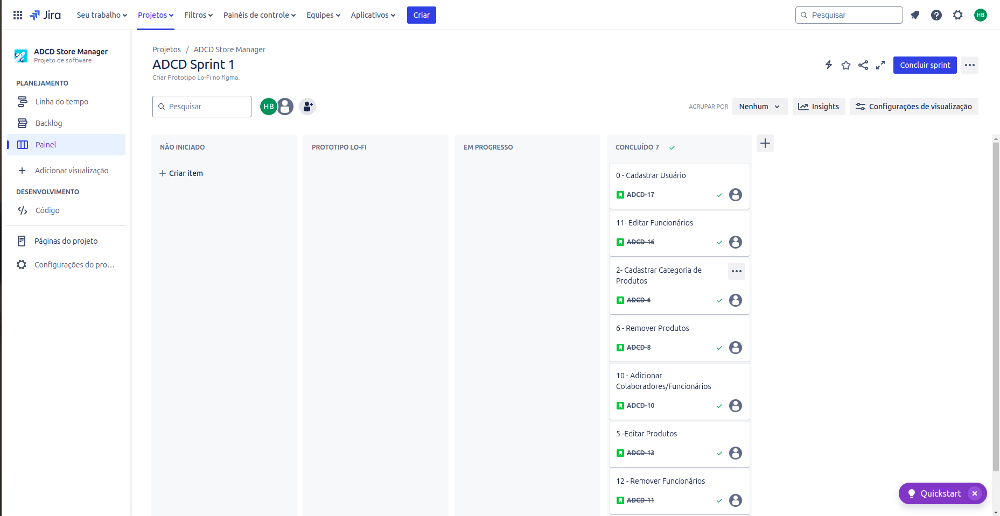

##  ADCD StoreManager

ADCD StoreManager é uma solução completa e intuitiva para gerenciamento de estoque, projetada para otimizar a operação de sua empresa e melhorar a eficiência na administração dos produtos. Com Controle de Inventário em tempo real, o ADCD StoreManager garante que você tenha sempre uma visão precisa das quantidades de estoque disponíveis, permitindo ajustes rápidos e evitando rupturas. 

## 🎯 Features

| Features             | ADCD StoreManager |
| --------------------   | :-------: |
| Controle de Inventário |    ✔️     |
| Registro de Produtos   |    ✔️     |
| Gestão de Fornecedores |    ✔️     |
| Alertas e Notificações |    ✔️     |
| Controle de Pedidos    |    ✔️     |
| Acesso e Segurança     |    ✔️     |

#### ⚙️ Funcionalidades

- **Controle de Inventário** - Monitoramento em tempo real da quantidade de produtos em estoque, com atualizações automáticas quando há entradas e saídas

- **Registro de Produtos** - Cadastro detalhado de produtos, incluindo informações como nome, descrição, código de barras, categoria e fornecedores

- **Gestão de Fornecedores** - Armazenamento e gerenciamento de informações sobre fornecedores, como dados de contato e histórico de compras

- **Alertas e Notificações** -  Alertas automáticos para quando os níveis de estoque atingem mínimos críticos, ajudando a evitar rupturas de estoque

- **Acesso e Segurança** - Controle de acesso para diferentes usuários, garantindo que apenas pessoal autorizado possa modificar ou visualizar informações críticas

## 📦 Tecnologias

## Entregas

### Entrega 1

- **Quadro de Histórias**

- **Link do jira e Print das Historias**

A descrição das historias está no Jira.

https://cesar-team-omws9jcc.atlassian.net/jira/software/projects/ADCD/boards/34/backlog

- **Link do Figma**
    
https://www.figma.com/design/h8iUL4X9aDi0fdhbmwFAkm/PROJETO-BAIXA-FIDELIDADE?node-id=0-1&t=53NrRXOKpaIkqws7-1

- **Link do Excalidraw**
    
[https://excalidraw.com/#room=c5d3c64e7ba02faf097d,kZaIXbL52UexlnZmBIus1A](https://excalidraw.com/#room=c5d3c64e7ba02faf097d,kZaIXbL52UexlnZmBIus1A)

- **Video das Historias**

https://www.youtube.com/watch?v=9WM5FAH4sw8

## 📄 Docs

[📄 Documentaçāo]() - Pendente....

## 👥 Creditos

[Davi Marques](https://github.com/davimqz) - dmo3@cesar.school

[Henrique Brito](https://github.com/HenriqueCBrito) - hscb@cesar.school

[Fernando Cavalcanti](https://github.com/FernandoCavalcantii) - fafhc@cesar.school

[Antônio Laprovitera](https://github.com/antoniolaprov) - aaal@cesar.school

[Gabriel Magalhães](https://github.com/gabrielmdev) - gmm@cesar.school

[João Rafael](https://github.com/JoaoRafael04) - jraf@cesar.school
